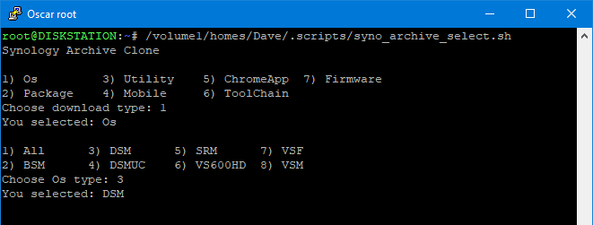
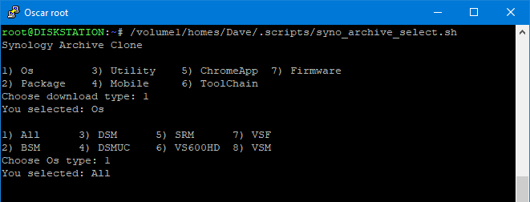
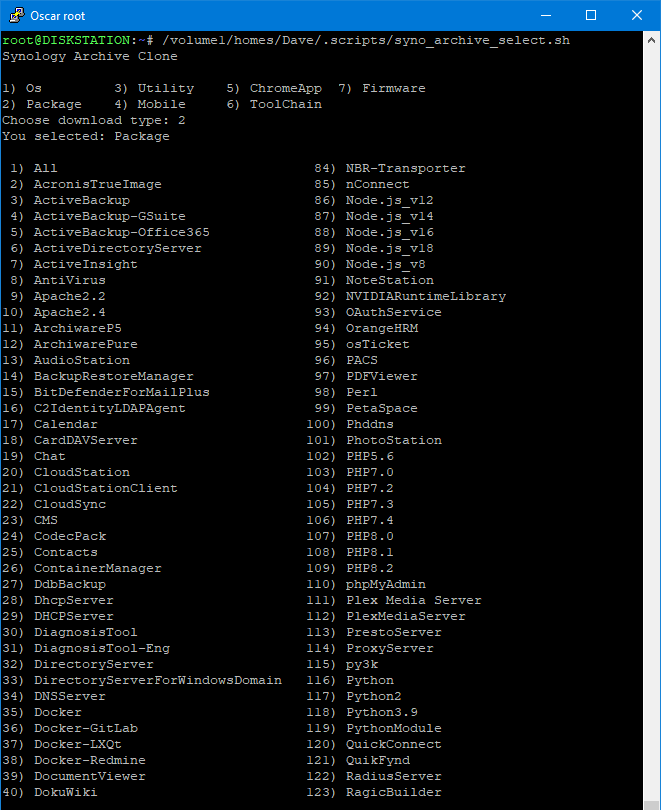
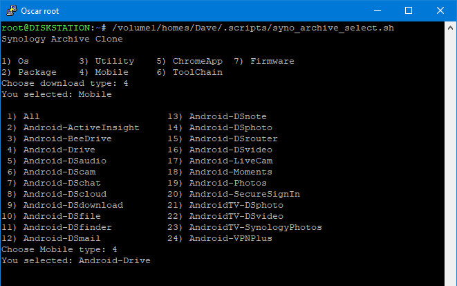
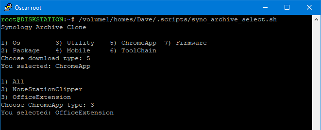
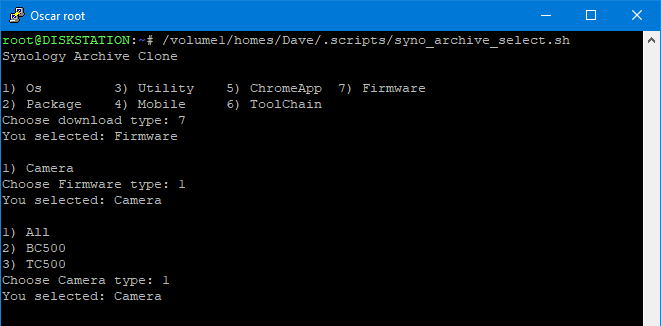

# Сохранить архив вашей Synology

### Описание

Легко загрузите часть или весь архив загрузок Synology.

### Основной PHP-скрипт

Вы можете запустить syno_archive_clone.php напрямую. Ему нужно 2 аргумента.

```
Usage: clone.php <srcdir> <subdir>
  Examples:
    php ./clone.php Os DSM
    php ./clone.php Package Docker
    php ./clone.php ToolChain "Synology NAS GPL Source"

To download all in the <srcdir> use All as the <subdir>
  Examples:
    php ./clone.php Os All
    php ./clone.php Package All

Firmware needs to include the firmware type in <scrdir>
  Examples:
    php ./clone.php Firmware/Camera BC500
    php ./clone.php Firmware/Camera TC500
    php ./clone.php Firmware/Camera All
```

**Регистрация вывода**

Если вы хотите записать вывод с датой и временем:

```
php ./clone.php <srcdir> <subdir> 2>&1 | tee ./clone_$(date '+%Y%m%d-%H%M').log

Example:
php ./clone.php Os DSM 2>&1 | tee ./clone_$(date '+%Y%m%d-%H%M').log
```

**Требования**

Вам нужно установить одну переменную, чтобы скрипт знал, куда вы хотите его загрузить:

    $destination = "/volume1/downloads/archive.synology.com";


<br>

### Скрипт запуска Bash

Чтобы упростить запуск clone.php, существует также [syno_archive_clone.sh](https://github.com/ZwiReKsyno/Download_Synology_Archive/raw/main/syno_archive_clone.7z), который предоставляет меню для выбора доступных <srcdir>опций <subdir>. Затем он запускает PHP-скрипт с этими параметрами в качестве аргументов.

Чтобы запустить syno_archive_clone.sh

    ./syno_archive_clone.sh

**Требования**

Вам нужно установить три переменные, чтобы скрипт знал, где находятся два PHP-скрипта и где сохранять журнал:

    php_script="/volume1/scripts/get_urls.php"
    
    php_script="/volume1/scripts/clone.php"
    
    php_log="/volume1/downloads/archive.synology.com/clone_$(date '+%Y%m%d-%H%M').log"

php_log может быть пустым, php_log=""если вы не хотите, чтобы что-либо регистрировалось. Или вы можете отключить его, поставив перед ним #:

    #php_log="/volume1/downloads/archive.synology.com/clone_$(date '+%Y%m%d-%H%M').log"

<br>

**Скриншоты скрипта запуска Bash**

<p align="leftr"></p>

<p align="leftr"></p>

<p align="leftr"></p>

<p align="leftr"></p>

<p align="leftr"></p>

<p align="leftr"></p>

<p align="leftr"></p>

<p align="leftr"></p>

<p align="leftr"></p>
